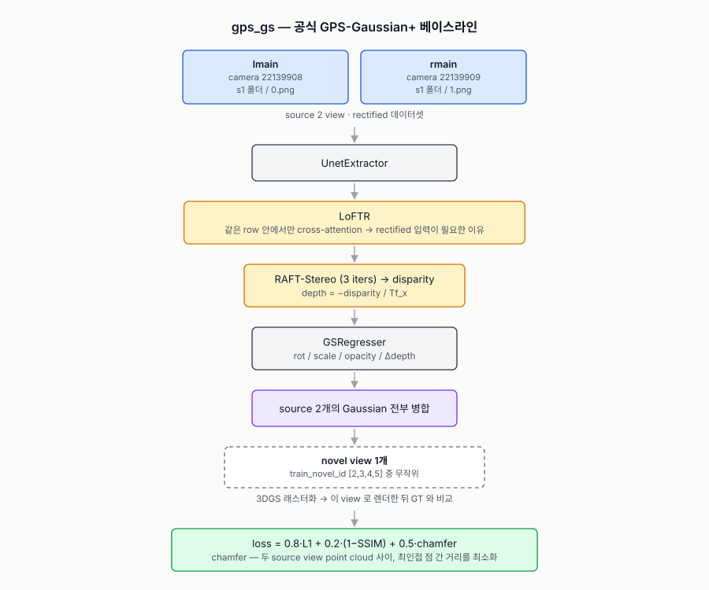
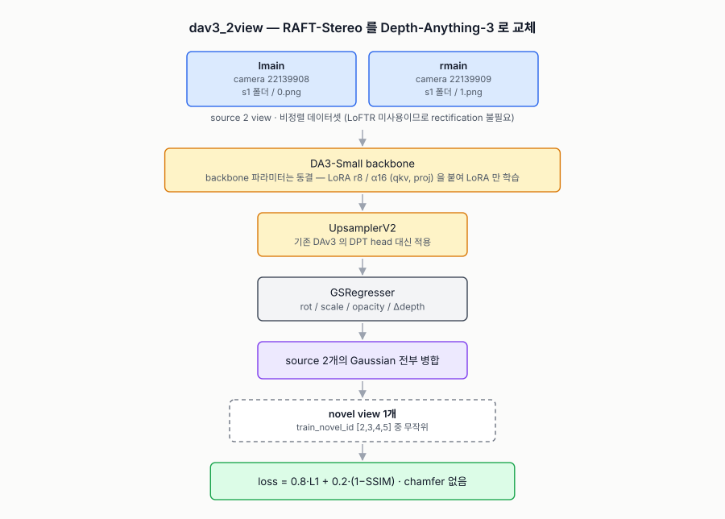
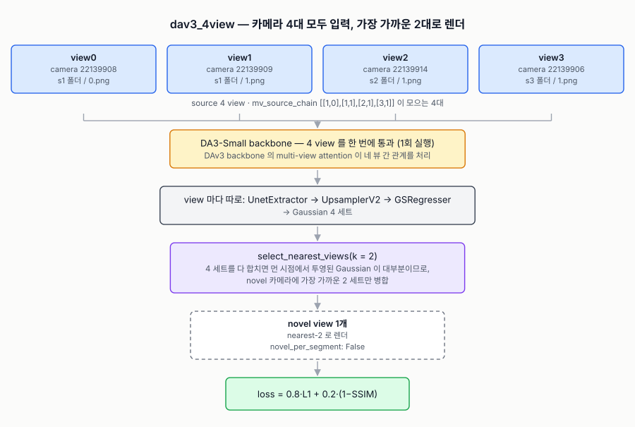
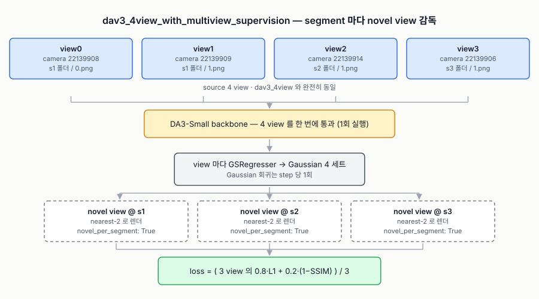

# 코드베이스 안내서

## 1. 코드 구조

```
train.py                  Trainer 전체 + 모델/데이터셋 dispatch + __main__
test.py                   체크포인트로 val set을 렌더해 PNG로 저장

config/<branch>/
  stereo_human_config.py  그 브랜치의 yacs 기본값 (브랜치마다 다름)
  stage.yaml              실제 실험 설정

lib/
  human_loader.py         StereoHumanDataset (2 view) + MultiViewStereoHumanDataset (N view)
  network.py              RtStereoHumanModel — gps_gs 의 모델
  GaussianRender.py       pts2render: view별 Gaussian을 모아 novel view로 래스터화
  view_select.py          select_nearest_views — render_nearest_k 구현
  runtime.py              train.py / test.py 공용 헬퍼 (freeze_bn, device 이동, view 선택)
  paths.py                PROJECT_ROOT / EXTERNAL_REPOS_DIR (경로 가정은 여기 한 곳만)
  gs_parm_network.py      GSRegresser — depth+RGB feature → rot/scale/opacity/Δdepth
  attention_module.py     LoFTR (gps_gs 전용)
  train_recoder.py        Logger (W&B), file_backup
  loss.py  utils.py  embedder.py  gs_utils/

gaussian_renderer/        diff_gaussian_rasterization 래퍼

core/                     RAFT-Stereo (gps_gs 전용). 단 extractor.py 의 UnetExtractor 는 네 브랜치 모두 사용

models/                   DAv3 스택 (DAv3 세 브랜치 전용)
  dav3_model.py           RtStereoHumanDAV3Model + DAV3Model_MK 래퍼 (2 view)
  dav3_mv_model.py        RtStereoHumanDAV3ModelUpsamplerMV + DAV3Model_MK_Upsampler_MV (N view)
  depth_anything_v3_model.py  DA3-Small 로딩/실행 래퍼
  lora.py                 backbone에 LoRA 어댑터 주입

data_process/             원본 THumanMV → 학습용 데이터셋
scripts/                  브랜치별 train_*.sh / test_*.sh
```


## 2. 브랜치별 config 차이

네 브랜치는 코드를 전부 공유하고 `config/<branch>/` 의 `stage.yaml` + `stereo_human_config.py`
로만 갈립니다. 아래는 **값이 실제로 다른 키만** 추린 것입니다 (나머지 키는 네 브랜치가 동일).

`—` 는 그 브랜치의 config 클래스에 키가 **없다**는 뜻이고, 괄호 안은 그때 코드가 쓰는
기본값입니다.

| 키 | `gps_gs` | `dav3_2view` | `dav3_4view` | `..._with_multiview_supervision` |
|---|---|---|---|---|
| `model_type` | `GPSGS` | `DAV3Model_MK` | `DAV3Model_MK_Upsampler_MV` | `DAV3Model_MK_Upsampler_MV` |
| `use_chamfer` | `True` | `False` | `False` | `False` |
| `dataset.num_source_views` | — (2) | — (2) | `4` | `4` |
| `dataset.mv_source_chain` | — | — | `[[1,0],[1,1],[2,1],[3,1]]` | `[[1,0],[1,1],[2,1],[3,1]]` |
| `dataset.render_nearest_k` | — (0 = 전부 병합) | — (0) | `2` | `2` |
| `dataset.novel_per_segment` | — | — | `False` | **`True`** |
| `dataset.view_coincide_tol` | — (1e-4) | — (1e-4) | `1.0e-4` | `1.0e-4` |
| `dataset.view_select_seed` | — (1314) | — (1314) | `1314` | `1314` |
| `dataset.inverse_depth_init` | `0.3` | `0.2` | `0.2` | `0.2` |
| `dataset.local_data_root` | `{PREPROCESSED_PATH}` | `{PREPROCESSED_WO_RECT_PATH}` | `{PREPROCESSED_WO_RECT_PATH}` | `{PREPROCESSED_WO_RECT_PATH}` |
| `raft.use_loftr_coarse` | — (읽지 않음) | `False` | `False` | `False` |


### 2.1 `dav3_*` 전용 블록

아래는 `gps_gs` 의 config 클래스에 없는, DAv3 세 브랜치에서 공유하여 사용하고 있는 값들입니다.

| 키 | 값 |
|---|---|
| `dav3.load_pretrained` / `freeze_backbone` | `True` / `True` |
| `dav3.tuning_mode` | `'lora'` |
| `dav3.lora.rank` / `alpha` / `dropout` / `target_modules` | `8` / `16.0` / `0.0` / `['qkv', 'proj']` |
| `dav3.process_res` / `process_res_method` | `504` / `'upper_bound_resize'` |
| `dav3.adapter_hidden_dim` | `64` |
| `dav3.min_inverse_depth` / `max_inverse_depth` | `1e-4` / `20.0` |
| `dav3.apply_gs_resdepth` | `True` |
| `dav3.add_layernorm_upsampler` | `True` |
| `dav3.upsampler_log_depth_range` | `3.0` |
| `external_models.depth_anything_v3.hf_repo_id` | `'depth-anything/DA3-SMALL'` |
| `external_models.depth_anything_v3.weights_path` | `None` (HuggingFace에서 다운로드) |


## 3. 브랜치별 상세


### 3.1 `gps_gs` — 공식 GPS-Gaussian+ 베이스라인



### 3.2 `dav3_2view` — RAFT-Stereo 를 Depth-Anything-3 로 교체



### 3.3 `dav3_4view` — 카메라 4대 모두 입력, 가장 가까운 2대로 렌더



### 3.4 `dav3_4view_with_multiview_supervision` — segment 마다 novel view 감독


